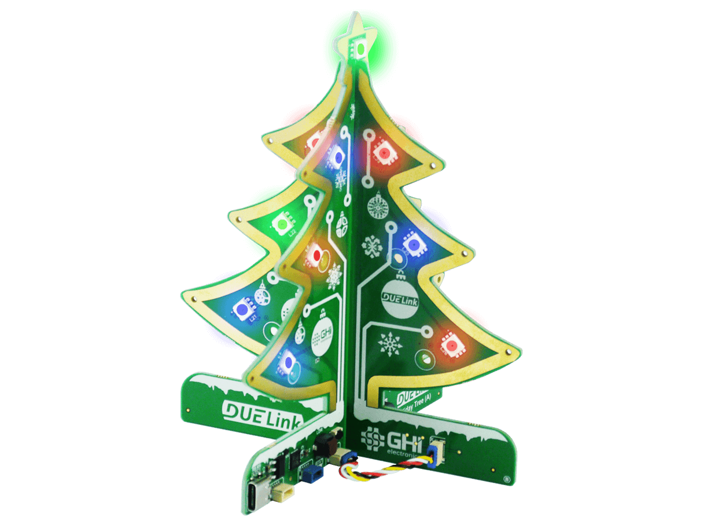
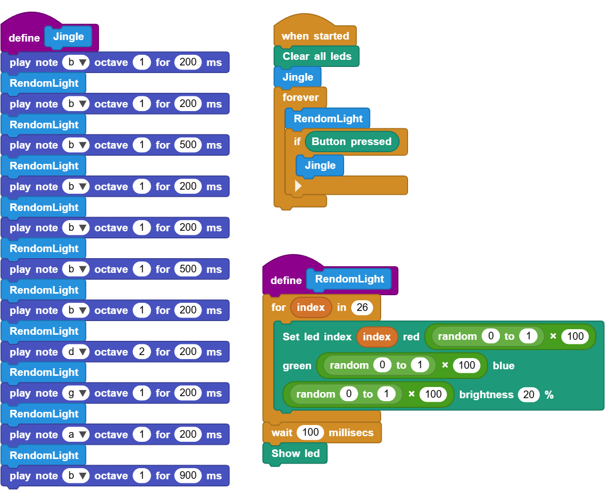
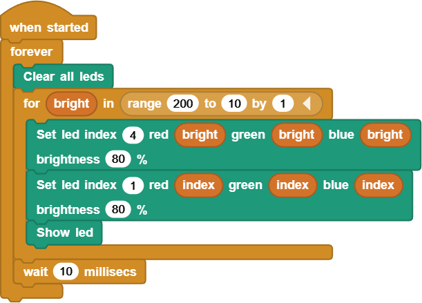
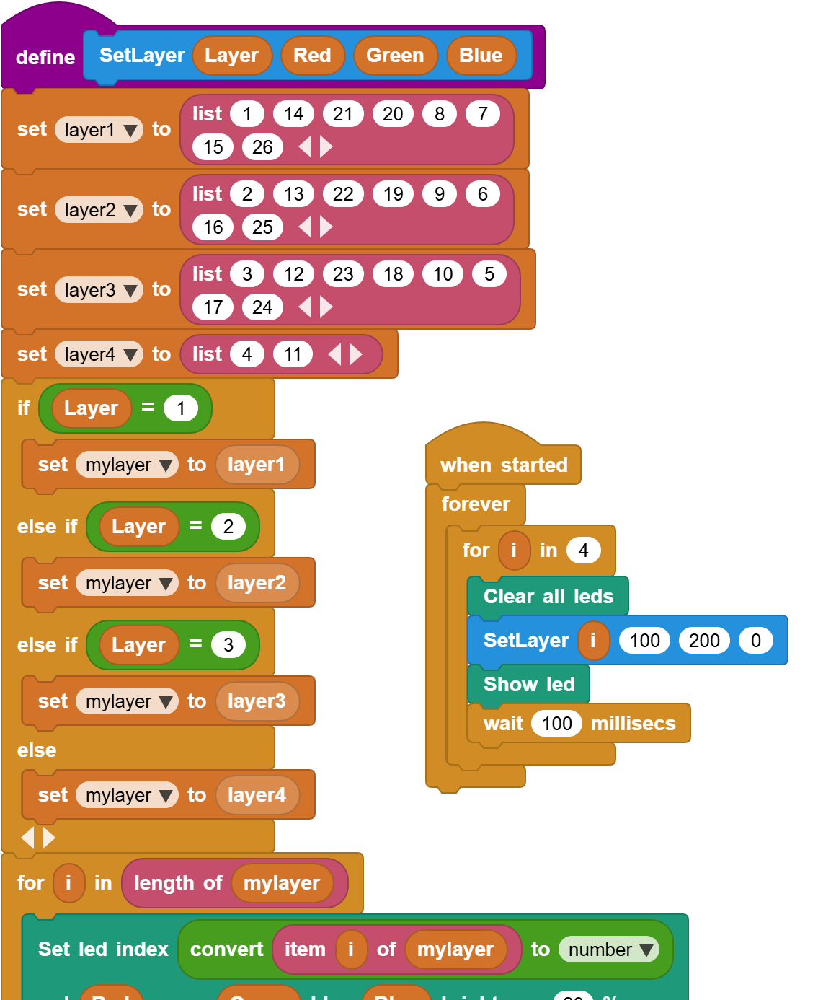
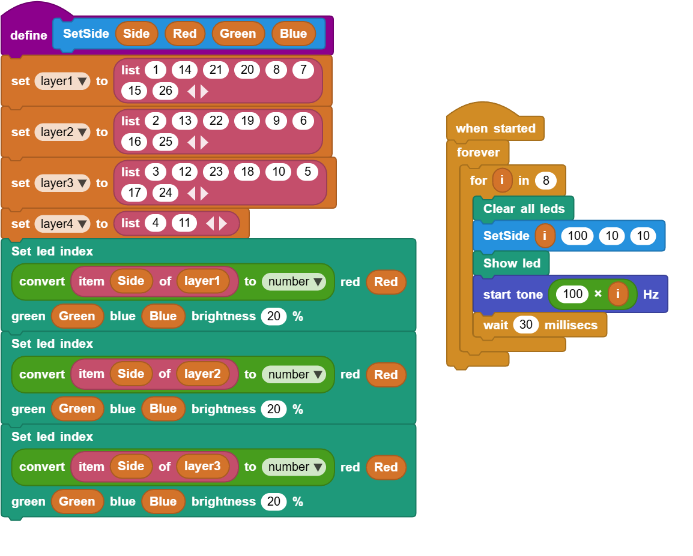
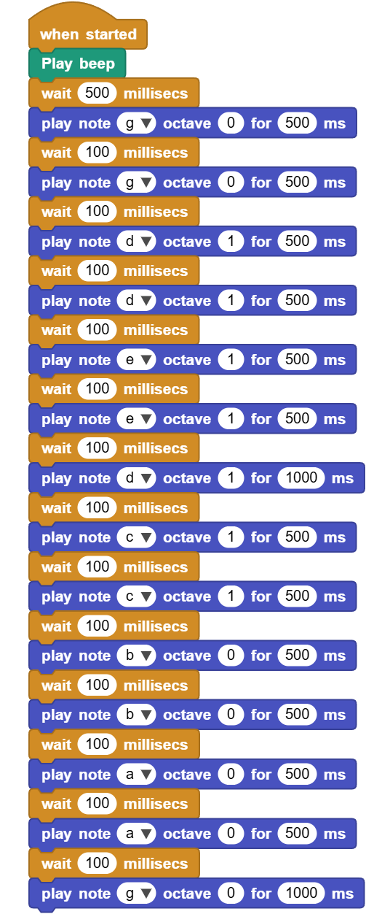
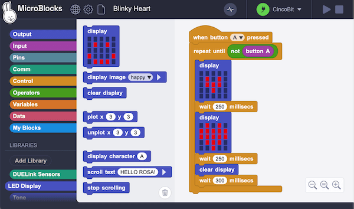
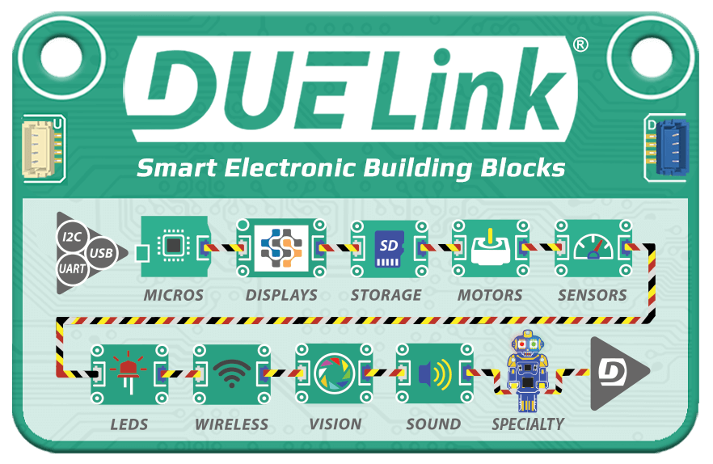

# DUELink Holiday Tree

This is a `Getting Started` page for `DUELink Holiday Tree`.

This page includes many demo programs/patterns that you can load onto your DUELink [Holiday Tree](https://www.duelink.com/docs/products/sptree-b). To load any of the demos, or to make your own, you need these steps:

1. Plug in the tree to your PC using a USB cable.
2. Go to [https://microblocks.fun/run/microblocks.html](https://microblocks.fun/run/microblocks.html). You will need to use `Edge` or `Chrome` Internet browsers.
3. Click `Connect` button on the top right corner. Then select the `USB` option.
4. You should have one option only but if more than one then select the `DUELink` device.
5. The connect button you clicked earlier changes to a `DUELink` next to a green connect icon.
6. Click and drag [This Tree Library Link](https://www.duelink.com/code/driver/microblocks/holiday-tree.ubl) into the middle of the MicroBlocks page. If not sure how to drag a link, click the link to save the library on your PC then drag the saved file into the MicroBlocks page.
7. You can now drag any of the images (Example Blocks) below into the IDE to try them.

**Note:** It is easier to have 2 browser windows open simultaneously to drag the library and images. Another option is to save the image/library locally onto your machine then drag them in the browser later!

---

## Example Blocks

Demo (Drag into MicroBlocks) | Functionality
--- | ---
 | This is the demo that ships on the tree.
 | Blink the LEDs Randomly.
 | The top emitting star.
 | Lights go up the tree, all the way to the star!
 | Rotate on all sides and make a buzzing noise.
 | Some "Twinkle" notes!

Are you ready to make your own demos? The demos work as is but you can modify the blocks to change the tree behavior. Congratulations, you are now a coder!

---

## What is MicroBlocks?

If you want to learn coding, the easy way, MicroBlocks is a blocks language that makes it easy for beginners (9 years to adults) to program DUELink boards. A huge benefit of MicroBlocks is that it is live and interactive: Users can click commands to see what they do and they can test their scripts as they work.

Learn more about using [MicroBlocks support](https://www.duelink.com/docs/language/microblocks) on DUELink products.

---

## What is DUELink?

DUELink revolutionizes electronics innovation with a vast ecosystem of sensor, actuator, and display modules. Each module is a mini-computer, powered by a smart daisylink that seamlessly integrates with your favorite hardware platform and coding language.

[Learn More...](https://www.duelink.com/docs/what-is)