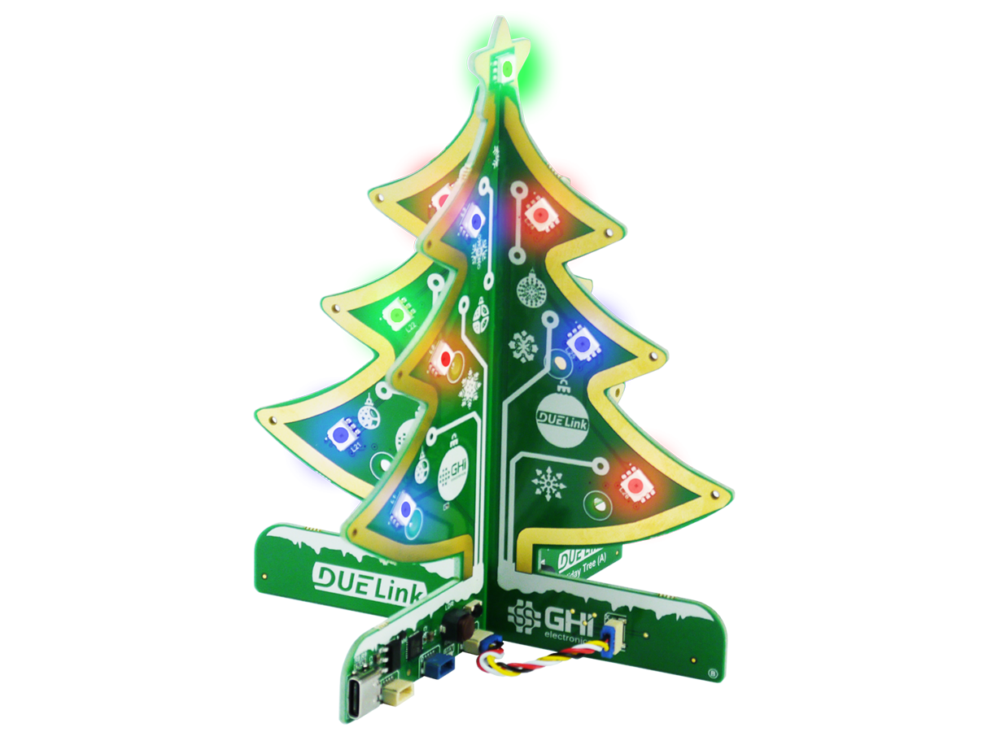
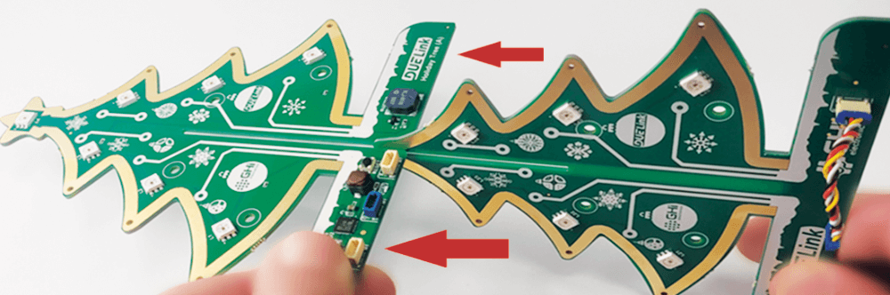
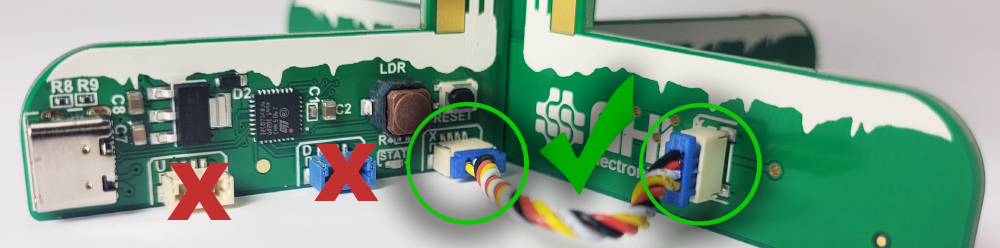
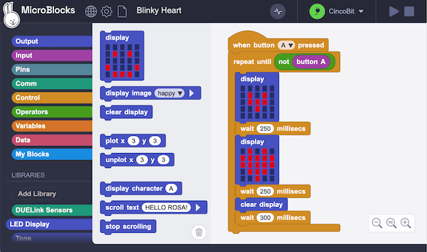

# DUELink Holiday Tree

Welcome to your programmable holiday tree! It ships preloaded with a demo, so you can juts plug it in and enjoy the show. If you need, the full product details are [here](https://www.duelink.com/docs/products/sptree-b) on the main DUELink website.

Don't have a DUELink Holiday Tree yet? Get yours today! 

 

---

Let's get started. Slide the two circuit boards together, ensure that the **X** connector on both boards is on the same side.

Connect the two **X** connectors using the included DUELink cable. 

Power up the tree using a PC, phone charger, or power bank and enjoy the preloaded demo.

You are now ready to load one of the demo projects below as is, or **change it** any way you like!

To load a project: **Click** ➡ **Connect** ➡ **Run**!

1. **Click** on one of the project links below to load it into MicroBlocks. We explain what MicroBlocks is later on this page.
2. Click **Connect** on the top right corner. Then select the `USB` option. From the new window, select `DUELink`. 
    1. While not likely,  your board may not have the latest firmware loaded. Go to [loader.duelink.com](https://loader.duelink.com/) to load the latest MicroBlocks firmware.
3. Click the **Run** triangle ▶ and enjoy! 🎉Congratulations, you are now a coder!

<table>
  <tr>
    <th>📽 Video</th>
    <th>Project Link</th>
    <th>Functionality</th>
  </tr>
  <tr>
    <td></td>
    <td><a href="https://microblocks.fun/run/microblocks.html?project=https://raw.githubusercontent.com/ghi-electronics/duelink-holiday-tree/refs/heads/main/code/demo.ubp" target="_blank">Default Project Demo</a></td>
    <td>This is default project demo. Press the LDR button to jingle again.</td>
  </tr>
  <tr>
    <td></td>
    <td><a href="https://microblocks.fun/run/microblocks.html?project=https://raw.githubusercontent.com/ghi-electronics/duelink-holiday-tree/refs/heads/main/code/random.ubp" target="_blank">Random Light Show</a></td>
    <td>Simplest program to blink the LEDs randomly.</td>
  </tr>
  <tr>
    <td></td>
    <td><a href="https://microblocks.fun/run/microblocks.html?project=https://raw.githubusercontent.com/ghi-electronics/duelink-holiday-tree/refs/heads/main/code/pulsar.ubp" target="_blank">Pulsating Star</a></td>
    <td>The top emitting star is too bright, don't stare at it!</td>
  </tr>
  <tr>
    <td></td>
    <td><a href="https://microblocks.fun/run/microblocks.html?project=https://raw.githubusercontent.com/ghi-electronics/duelink-holiday-tree/refs/heads/main/code/shooting-star.ubp" target="_blank">Shooting Star</a></td>
    <td>Lights go up the tree, all the way to the star!</td>
  </tr>
  <tr>
    <td></td>
    <td><a href="https://microblocks.fun/run/microblocks.html?project=https://raw.githubusercontent.com/ghi-electronics/duelink-holiday-tree/refs/heads/main/code/spaceship.ubp" target="_blank">Spaceship</a></td>
    <td>Rotate on all sides and make a buzzing noise. We call this a tree spaceship!</td>
  </tr>
  <tr>
    <td></td>
    <td><a href="https://microblocks.fun/run/microblocks.html?project=https://raw.githubusercontent.com/ghi-electronics/duelink-holiday-tree/refs/heads/main/code/twinkle.ubp" target="_blank">Twinkle</a></td>
    <td>Push the LDR button to play some "Twinkle" notes!</td>
  </tr>
     <tr>
    <td></td>
    <td><a href="https://microblocks.fun/run/microblocks.html?project=https://raw.githubusercontent.com/ghi-electronics/duelink-holiday-tree/refs/heads/main/code/disylink-snowy.ubp" target="_blank">Snowy Daisylink!</a></td>
    <td>Control any other daisylinked modules, such as Snowy. Note that any Daisylinked module must be loaded with the provided DUELink firmware and the module's driver.</td>
  </tr>
</table>

---

## What is MicroBlocks?

MicroBlocks is a block-based language that is easy for beginners (9 years to adults) to program DUELink boards. A huge benefit of MicroBlocks is that it is live and interactive; users can click commands to see what they do and they can test their scripts as they work.

Learn more about DUELink's [MicroBlocks support](https://www.duelink.com/docs/language/microblocks).

---

## Beyond MicroBlocks

Just like all DUELink boards, this holiday tree works with a variety of Coding Languages, such as Python and JavaScript. The [Getting Started](https://www.duelink.com/docs/start) page has a good common DUELink starting point.

Using [Arduino](https://www.duelink.com/docs/hw/arduino) is another great option. The Arduino IDE can be used to write programs that run right on holiday tree.

---

## Connect with us!

The Holiday Tree is possible because of our DUELink technology. But what is DUELink? Click [here](https://www.duelink.com/docs/what-is) to learn more.

Join our newsletter and social channels [here](https://www.duelink.com/news).

Talk to us using [our forums](https://forums.ghielectronics.com/c/duelink/31).
