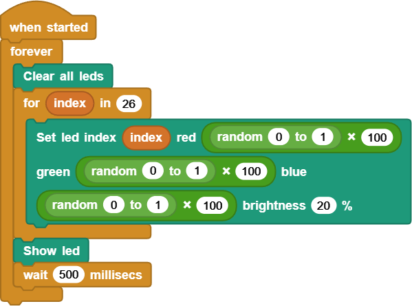

# DUELink Holiday Tree

This page includes many example programs/patterns that you can load onto your DUELink [Holiday Tree](https://www.duelink.com/docs/products/sptree-b)

To load any of the samples, you need these steps:
1. Plug in the tree to your PC using a USB C cable (not included).
2. Go to [https://microblocks.fun/run/microblocks.html](https://microblocks.fun/run/microblocks.html). You will need to use `Edge` or `Chrome` Internet browsers.
3. Click connect button on the top right corner. Then select the USB option.
4. You should have one option only but if more than one then select the `DUELink` device.
5. The connect button you clicked earlier changes to a `DUELink` next to a green connect icon.
6. Click and drag [This Tree Library Link](https://www.duelink.com/code/driver/microblocks/holiday-tree.ubl) into the middle of the MiroBlocks page.
You can now drag any of hte images below into the IDE to try them.

Note: It is easier to have 2 browser windows open simultaneously to drag the library and images. Another option is to save the image/library locally onto your machine then drag them in the browser later!

---

## Example Patterns

Demo | Function
--- | ---
 | Blink the LEDs Randomly!
 | Example 2
 | Example 4
 | Example 5
 | Example 6
 | Example 7

<table>
<td width='50%'>
    
</td>
<td width='50%'>
    
</td>
</table>

---

---

## What is MicroBlocks?

If you want to learn coding, the easy way, MicroBlocks is a blocks language (like Scratch) that makes it easy for beginners (9 years to adults) to program DUELink boards. A huge benefit of MicroBlocks is that it is live and interactive: users can click commands to see what they do and they can test their scripts as they work.

Learn how to start with [MicroBlocks support](https://www.duelink.com/docs/language/microblocks) on DUELink products.

Now, go ahead and drag any of the block below into MicroBlocks and see how blocks turn into magic!

---

## What is DUELink?

DUELink revolutionizes electronics innovation with a vast ecosystem of sensor, actuator, and display modules. Each module is a mini-computer, powered by a smart daisylink that seamlessly integrates with your favorite hardware platform and coding language.

[Learn More...](https://www.duelink.com/docs/what-is)