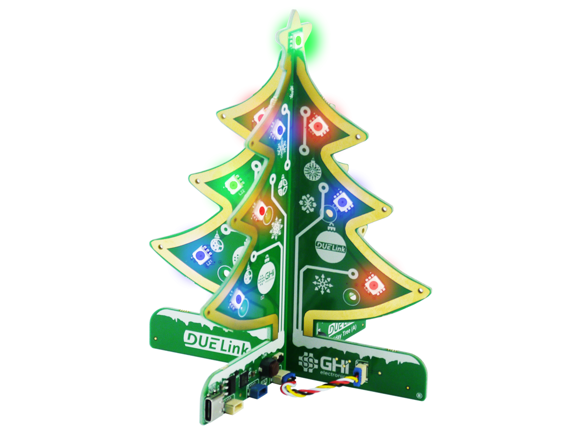

# DUELink Holiday Tree

This page is a `Getting Started` page for `DUELink Holiday Tree`. The full product details are [here](https://www.duelink.com/docs/products/sptree-b) on the main DUELink website. Are you an educator? See how DUELink can help you [here](https://www.duelink.com/docs/educators).

Don't have a DUELink Holiday Tree yet? Get yours today! 

 

<iframe width="560" height="315" src="https://www.youtube.com/embed/xw6P_5qS9cI?si=mltHlqchIC6u5d2i" title="YouTube video player" frameborder="0" allow="accelerometer; autoplay; clipboard-write; encrypted-media; gyroscope; picture-in-picture; web-share" referrerpolicy="strict-origin-when-cross-origin" allowfullscreen></iframe>

Slide the two circuit boards together, ensure that the **X** connector on both boards is on the same side.

Connect the two **X** connectors using the included DUELink cable. 

Power up the tree using a PC, phone charger, or power bank and enjoy the preloaded demo. Then use any computer to load one of the demo projects below as is, or **change it** any way you like!

To load a project: **Click** ➡ **Connect** ➡ **Run**!

1. **Click** on one of the project links below to load it into MicroBlocks. We explain what MicroBlocks is later on this page.
2. Click **Connect** on the top right corner. Then select the `USB` option. From the new window, select `DUELink`. 
    2. While not likely to happen, if you do not see a `DUELink` device, then you need to reload the MicroBlocks firmware. This is explained later on this page.
3. Click the **Run** triangle ▶ and enjoy! 🎉Congratulations, you are now a coder!

<table>
  <tr>
    <th>📽 Video</th>
    <th>Project Link</th>
    <th>Functionality</th>
  </tr>
  <tr>
    <td></td>
    <td><a href="https://microblocks.fun/run/microblocks.html?project=https://raw.githubusercontent.com/ghi-electronics/duelink-holiday-tree/refs/heads/main/code/demo.ubp" target="_blank">Default Project Demo</a></td>
    <td>This is default project demo. Press the LDR button to jingle again.</td>
  </tr>
  <tr>
    <td></td>
    <td><a href="https://microblocks.fun/run/microblocks.html?project=https://raw.githubusercontent.com/ghi-electronics/duelink-holiday-tree/refs/heads/main/code/random.ubp" target="_blank">Random Light Show</a></td>
    <td>Simplest program to blink the LEDs randomly.</td>
  </tr>
  <tr>
    <td></td>
    <td><a href="https://microblocks.fun/run/microblocks.html?project=https://raw.githubusercontent.com/ghi-electronics/duelink-holiday-tree/refs/heads/main/code/pulsar.ubp" target="_blank">Pulsating Star</a></td>
    <td>The top emitting star is too bright, don't stare at it!</td>
  </tr>
  <tr>
    <td></td>
    <td><a href="https://microblocks.fun/run/microblocks.html?project=https://raw.githubusercontent.com/ghi-electronics/duelink-holiday-tree/refs/heads/main/code/shooting-star.ubp" target="_blank">Shooting Star</a></td>
    <td>Lights go up the tree, all the way to the star!</td>
  </tr>
  <tr>
    <td></td>
    <td><a href="https://microblocks.fun/run/microblocks.html?project=https://raw.githubusercontent.com/ghi-electronics/duelink-holiday-tree/refs/heads/main/code/spaceship.ubp" target="_blank">Spaceship</a></td>
    <td>Rotate on all sides and make a buzzing noise. We call this a tree spaceship!</td>
  </tr>
  <tr>
    <td></td>
    <td><a href="https://microblocks.fun/run/microblocks.html?project=https://raw.githubusercontent.com/ghi-electronics/duelink-holiday-tree/refs/heads/main/code/twinkle.ubp" target="_blank">Twinkle</a></td>
    <td>Push the LDR button to play some "Twinkle" notes!</td>
  </tr>
</table>

---

## What is MicroBlocks?

If you want to learn coding the easy way, MicroBlocks is a block-based language that is easy for beginners (9 years to adults) to program DUELink boards. A huge benefit of MicroBlocks is that it is live and interactive; users can click commands to see what they do and they can test their scripts as they work.

Learn more about DUELink's [MicroBlocks support](https://www.duelink.com/docs/language/microblocks).

---

## Connect with us!

The Holiday Tree is possible because of our DUELink technology. But what is DUELink? Click [here](https://www.duelink.com/docs/what-is) to learn more.

Join our newsletter and social channels [here](https://www.duelink.com/news).

We are also on the DUELink section on [our forums](https://forums.ghielectronics.com/c/duelink/31).

---

## Reload MicroBlocks Firmware

In the unlikely event that MicroBlocks software is not seeing your device, then you need to follow these steps:

1. There are 2 buttons found on the board, Loader (LDR) and Reset (RST). Locate the buttons.
2. Press and hold the LDR button while pressing and releasing RST button. Note how you need to keep holding the LDR button pressed while pressing and releasing the RST button.
2. Go to [console.duelink.com](https://console.duelink.com/) and click `Firmware` on the top menu.
3. Click `Connect` button. You should see `DFU in FS Mode - Paired`. Select it and click `Connect`.
4. Select `MicroBlocks` from the `Firmware` menu.
5. Click `Load` button. You can optionally click `Erase All` first for a complete fresh start!
5. Click `Close`.

The board is now loaded with MicroBlocks firmware, which is what the MicroBlocks software uses to communicate with the board.

---

## The "Making of" Videos

Curious on how products are developed? Here are some videos of us working on this design:

📽 Video | Description
---|---
 | Designing the Holiday Tree. Going from an idea to an actual product.
 | Manufacturing the Holiday Tree. Going from a raw PCB to a working product.
 | Troubleshooting the Holiday Tree. Things don't usually just work the first time!
 | The cutest Holiday Tree by Selena, how Ghizzy came about, and partnering up with MicroBlocks.